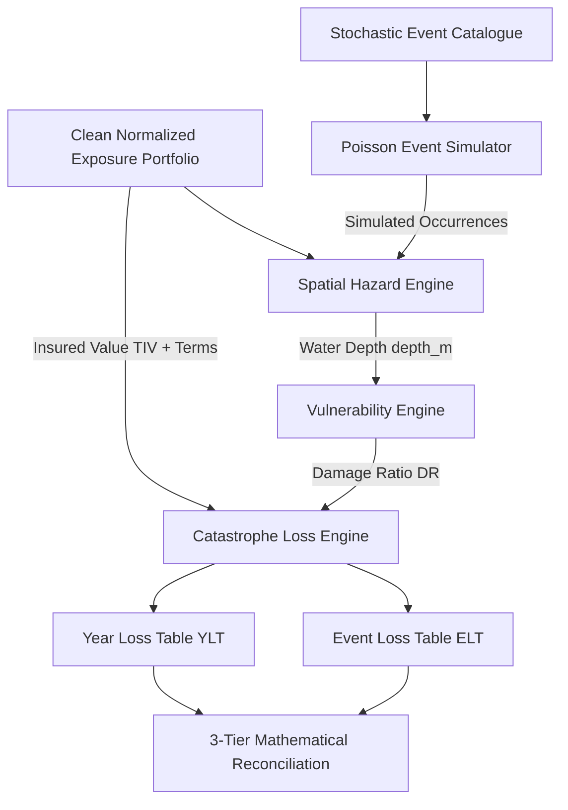

# FLOODTAIL — Catastrophe Risk Methodology & Model Documentation

**Document Version:** 1.0.0  
**Phase:** 3 — Catastrophe Modeling Spine  
**Date:** October 2026  

---

## 1. Scientific Principles & Pipeline Architecture

FLOODTAIL models catastrophe flood risk through the canonical physical-to-financial risk transformation pipeline:

$$\text{EXPOSURE} + \text{EVENT SET} \longrightarrow \text{HAZARD} \longrightarrow \text{VULNERABILITY} \longrightarrow \text{FINANCIAL LOSS} \longrightarrow \text{ELT} \longrightarrow \text{YLT}$$

---

## 2. Mathematical Formulation

### 2.1 Stochastic Event Occurrence Model
Annual flood occurrence follows a homogeneous Poisson process with annual arrival intensity $\lambda$:

$$N_y \sim \text{Poisson}(\lambda), \quad \lambda = \sum_{k=1}^K f_k$$

where $f_k$ is the annual frequency of reference event $k$ in the catalogue.

When an event occurs, event $k$ is sampled according to its relative frequency weight:

$$P(E = k) = \frac{f_k}{\sum_{j=1}^K f_j}$$

### 2.2 Spatial Hazard Field & Zero-Depth Rule
For an event occurrence $e$ with epicenter $(lat_e, lon_e)$, spatial footprint radius $R_e$, severity factor $S_e$, and base depth $D_0$:

The distance $d(i, e)$ between property location $(lat_i, lon_i)$ and event epicenter is computed using spherical geodesic approximation.

$$\text{depth}(i, e) = \begin{cases} 
D_0 \cdot S_e \cdot \left(1 - \frac{d(i,e)}{R_e}\right) & \text{if } d(i,e) \le R_e \\
0.0 & \text{if } d(i,e) > R_e \text{ (Zero-Depth Rule)}
\end{cases}$$

### 2.3 Vulnerability & Damage Ratios
Damage ratio $DR(i, e) \in [0, 1]$ is evaluated using piecewise linear depth-damage curves $g_c(d)$ conditional on property classification and construction resistance modifier $\mu_{\text{cclass}}$:

$$DR(i, e) = \min\left(1.0, \max\left(0.0, g_{\text{ptype}}(\text{depth}(i,e)) \cdot \mu_{\text{cclass}}\right)\right)$$

**Monotonicity Constraint:**
$$\forall d_2 \ge d_1 \ge 0 \implies DR(d_2) \ge DR(d_1)$$

### 2.4 Financial Loss Calculation & Policy Terms
1. **Ground-Up Loss:**
   $$L_{\text{groundup}}(i, e) = \text{TIV}_i \times DR(i, e)$$
2. **Net Loss (with Deductible $D_i$ and Policy Limit $M_i$):**
   $$L_{\text{net}}(i, e) = \min\left(\max\left(L_{\text{groundup}}(i, e) - D_i, 0\right), M_i\right)$$

---

## 3. Financial Table Structures

### 3.1 Event Loss Table (ELT)
Primary intermediate table containing every impacted exposure-event pair:
- `simulation_year`: Integer simulation year $\in [1, N_{\text{years}}]$
- `occurrence_id`: Sequence occurrence identifier
- `event_id`: Unique event catalogue identifier
- `policy_id`: Insured property identifier
- `depth_m`: Water depth at policy coordinates (metres)
- `damage_ratio`: Mean damage ratio $\in [0, 1]$
- `insured_value`: Policy Total Insured Value (TIV)
- `ground_up_loss`: Monetary ground-up loss
- `deductible`: Policy deductible applied
- `policy_limit`: Policy indemnity limit applied
- `loss`: Final net financial loss amount

### 3.2 Year Loss Table (YLT)
Annual aggregate catastrophe loss summary for every simulated year $y \in [1, N_{\text{years}}]$:
- `simulation_year`: Integer simulation year
- `annual_loss`: Total aggregate loss in year $y = \sum_{e \in y} \sum_{i} L(i, e)$
- `max_event_loss`: Peak single-event loss in year $y = \max_{e \in y} \left(\sum_i L(i, e)\right)$
- `event_count`: Number of event occurrences in year $y$
- `event_ids`: Array of event IDs occurring in year $y$

---

## 4. Multi-Tier Reconciliation Proofs

Every simulation execution strictly verifies 3 mandatory mathematical identities:

1. **Event-Level Equivalence:**
   $$\text{EventLoss}(e) = \sum_{i \in \text{Exposures}} L(i, e)$$
2. **Annual-Level Equivalence:**
   $$\text{AnnualLoss}(y) = \sum_{e \in \text{Events}(y)} \text{EventLoss}(e)$$
3. **Portfolio Total Equivalence:**
   $$\sum \text{ELT Loss} \equiv \sum \text{YLT Annual Loss} \quad (\text{tolerance } \epsilon = 10^{-4})$$

---

## 5. Model Lineage & Reproducibility

Every catastrophe run produces verifiable provenance metadata:
- Deterministic random seed initialization
- SHA-256 fingerprinting of Event Catalogue, Hazard Table, ELT, and YLT
- SQLite registration linking input portfolio versions to produced analytical snapshots

---

---

## 7. Risk Analytics & Exceedance Probability (Phase 4)

FLOODTAIL transforms empirical catastrophe loss tables into actuarial risk metrics:

### 7.1 Average Annual Loss (AAL)
$$\text{AAL} = \frac{1}{N} \sum_{y=1}^N L_y$$
where $L_y$ is the aggregate portfolio loss in simulation year $y$.

### 7.2 Occurrence Exceedance Probability (OEP) vs. Aggregate Exceedance Probability (AEP)
- **OEP (Occurrence Exceedance Probability):** The probability that the *maximum single event loss* in any given year exceeds threshold $x$:
  $$\text{OEP}(x) = P\left(\max_{e \in y} L_e > x\right)$$
- **AEP (Aggregate Exceedance Probability):** The probability that the *total annual aggregate loss* exceeds threshold $x$:
  $$\text{AEP}(x) = P\left(\sum_{e \in y} L_e > x\right)$$

Exceedance probabilities for standard return periods $T \in \{10, 25, 50, 100, 250, 500\}$ are evaluated via empirical Weibull rank order plotting:
$$P_k = \frac{k}{N + 1}, \quad T_k = \frac{1}{P_k}$$

### 7.3 Probable Maximum Loss (PML) & Value at Risk (VaR)
At confidence level $\alpha$ (e.g. $\alpha = 0.99, 0.996$ corresponding to 1-in-100 and 1-in-250 year return periods):
$$\text{VaR}_\alpha = Q_{\text{empirical}}(L, \alpha)$$

### 7.4 Tail Value at Risk (TVaR / Expected Shortfall) with Exact Boundary Weighting
For sample size $N$ and confidence level $\alpha$, tail mass is $(1 - \alpha) N$. If the cutoff index falls on a fractional boundary, observation weights $w_y$ are applied:
$$\text{TVaR}_\alpha = \sum_{y \in \text{Tail}} w_y L_y, \quad \text{where } \sum_{y \in \text{Tail}} w_y = 1.0$$

---

## 8. Policy Tail Risk Contribution (Exact TVaR Allocation)

To determine how individual contracts contribute to portfolio tail risk, policy losses are extracted for the exact portfolio tail simulation years identified in the TVaR calculation:

$$\text{TailContribution}_i = \sum_{y \in \text{Tail}} w_y L_{i,y}$$

**Mandatory TVaR Reconciliation:**
$$\sum_{i=1}^M \text{TailContribution}_i \equiv \text{Portfolio TVaR}_\alpha \quad (\epsilon < 10^{-4})$$
$$\sum_{i=1}^M \text{AAL}_i \equiv \text{Portfolio AAL} \quad (\epsilon < 10^{-4})$$

> [!NOTE]
> **Allocation Terminology:**
> FLOODTAIL uses "Empirical Tail Contribution" or "Tail-Weighted Policy Contribution". This represents the exact conditional expected loss during portfolio tail years. It is distinct from game-theoretic Shapley values or formal continuous Euler derivatives.

---

## 9. Portfolio Accumulation & Spatial Co-Hits

- **TIV vs. Loss Concentration:** Evaluates top 1%, 5%, and 10% accumulation shares alongside Herfindahl-Hirschman Index (HHI) for regional and occupancy dimensions.
- **Co-Hit Frequency & TIV:** Measures systemic portfolio correlation by computing the number of events in which multiple policies suffer simultaneous damage:
  $$\text{CoHitRate}_i = \frac{\text{Count of events affecting policy } i \text{ and at least one other policy}}{\text{Total events affecting policy } i}$$

---

## 10. Technical Pricing Engine Waterfall

Technical reinsurance pricing implements a risk-based capital loading formula:

$$\text{Premium}_i = \text{ExpectedLoss}_i + \text{TailRiskCharge}_i + \text{Expense}_i$$

1. **Expected Loss:** $\text{ExpectedLoss}_i = \text{AAL}_i$
2. **Tail Risk Charge:** $\text{TailRiskCharge}_i = r \cdot \max\left(0, \text{TailContribution}_i - \text{AAL}_i\right)$
3. **Expense Allowance:** $\text{Expense}_i = e \cdot \left(\text{ExpectedLoss}_i + \text{TailRiskCharge}_i\right)$

Where:
- $r$ = Cost-of-capital rate (prototype baseline: 10.0% / 0.10)
- $e$ = Expense loading rate (prototype baseline: 10.0% / 0.10)

**Strict Reconciliation:**
$$\text{ExpectedLoss}_i + \text{TailRiskCharge}_i + \text{Expense}_i \equiv \text{Technical Premium}_i$$

---

## 11. Marginal TVaR & Common Random Numbers (CRN)

To compute the standalone systemic impact of adding or removing policy $k$:
$$\text{Marginal TVaR}_k = \text{TVaR}(\text{Portfolio}) - \text{TVaR}(\text{Portfolio} \setminus \{k\})$$

**Common Random Numbers (CRN):**
The counterfactual loss distribution without policy $k$ is evaluated across the **exact same simulated years** $y \in [1, N]$ by setting $L_{-k, y} = L_y - L_{k,y}$. This guarantees that marginal risk metrics isolate the physical asset footprint from Monte Carlo simulation noise.

---

## 12. Risk Appetite Governance Rules

Deterministic underwriting rules flag policies for escalation or review:
- **TVaR Tail Share:** If $\text{Tail Share}_i > 10.0\% \implies \text{REVIEW}$
- **Marginal TVaR Share:** If $\text{Marginal Share}_i > 15.0\% \implies \text{ESCALATE}$
- **Spatial Co-Hit Rate:** If $\text{CoHitRate}_i > 80.0\% \implies \text{ELEVATED\_CO\_HIT}$

---

## 13. Scientific Limitations & Disclosure

> [!WARNING]
> **Prototype Scientific Disclosure:**
> - Risk analytics and pricing formulas are prototype actuarial models designed to illustrate tail risk differentiation and spatial accumulation.
> - They do **NOT** represent official Kenya Re proprietary rating algorithms or regulatory solvency capital requirements.

