# FLOODTAIL — Backend Architecture & Workflow

**Product job:** Help a reinsurance **underwriter** understand flood risk for **whatever portfolio they ingest** (Nairobi today, other places tomorrow), see grounded loss / capital numbers, and get a **simple actionable insight** — e.g. how many insured houses are in play and how much to set apart without under- or over-budgeting.

**AI posture:** **Agentic-first** (LangGraph + LangChain) + **predictive ML**. Agents orchestrate analysis and may **present money numbers**, but only numbers produced by real pipeline analysis — never guessed or invented by the LLM.

---

## 0. Who · what · why (one screen)

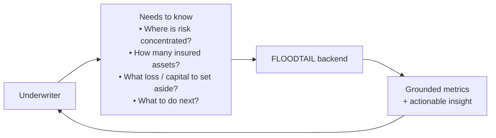

| Question the underwriter asks | What the system answers |
|-------------------------------|-------------------------|
| What did I upload? | Location-agnostic portfolio from **ingested data** (count, TIV, classes, bbox) |
| How bad can flood losses get? | EP / RP losses from **analysis pipeline** (ML + financial math) |
| How much should I set apart? | Recommended capital / budget band — **not under, not over** — derived from EP/AAL + appetite rules |
| What should I do? | Short actionable insight: `ACCEPT` / `REVIEW` / `ESCALATE` + next step |

---

## 1. System context (flexible geography)

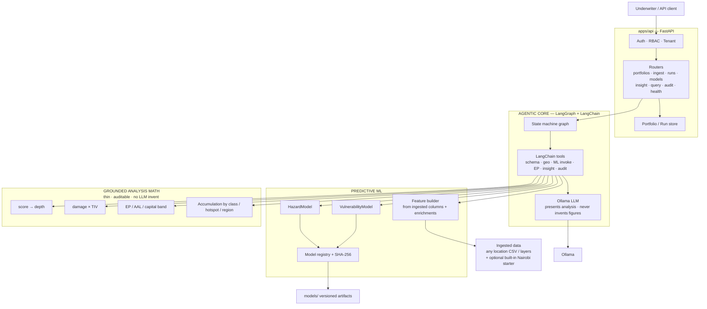

**Flexibility rule:** no Nairobi-only business logic in code paths. Location, housing classes, RP profile, and enrichment layers come from **what was ingested** + a **run assumptions profile**. Nairobi is a starter dataset, not the product boundary.

---

## 2. Authority: who may say money numbers

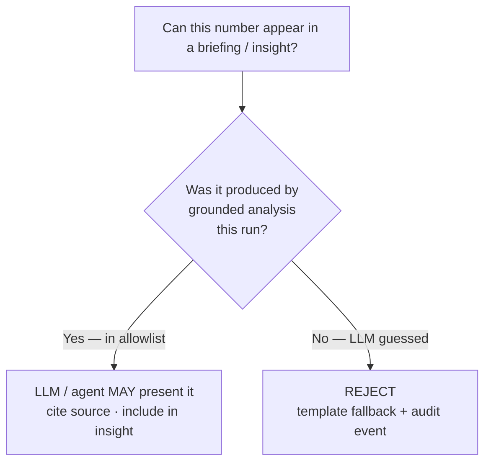

| Source | Examples | LLM may present? |
|--------|----------|------------------|
| Ingest stats | `# insured houses`, total TIV, class mix | Yes |
| ML outputs | predicted hazard scores, damage ratios | Yes (as model outputs) |
| Grounded math | tier losses, EP points, AAL, **capital set-aside band** | Yes — **only after computed** |
| LLM free imagination | “loss is 50M because I think so” | **Never** |

Agents do **real analysis** (tools call ML + math). The LLM **narrates and recommends** using those tool results. That is “agentic analysis,” not guessing.

---

## 3. LangGraph pipeline (location-flexible)

Critical stages halt on `FAILED`. Insight stage is required for underwriter value but can degrade to a deterministic template if Ollama is down (numbers still from allowlist).

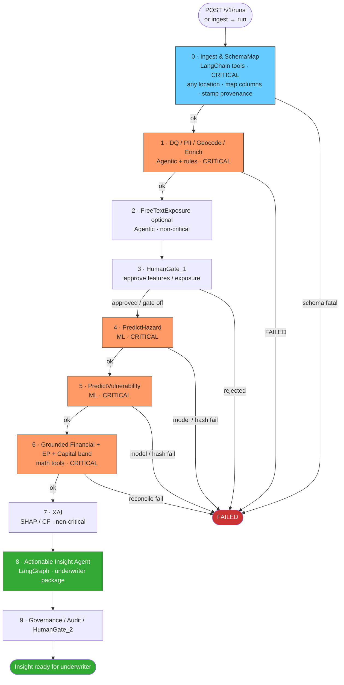

---

## 4. Underwriter actionable insight (core product output)

For a specific ingested location / portfolio (example: Nairobi), the insight package must answer:

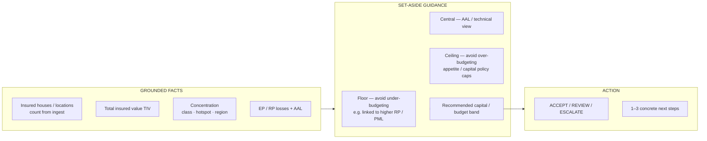

### Example insight shape (illustrative)

```text
Location / book: Nairobi County (from ingest)
Insured houses: 600
Total TIV: KES X

Recommended set-aside (this run):
  · Do not go below: KES L  (under-budget risk — e.g. RP100 / agreed PML proxy)
  · Central view:     KES C  (discrete AAL / technical)
  · Do not exceed:    KES H  (over-budget / appetite ceiling)

Recommendation: REVIEW
Why:
  · Informal housing share drives Y% of tier loss
  · Hotspot overlap: N named areas
Next:
  · Cap new writings in top hotspot cluster
  · Re-run after actuary checks vuln model pin
```

All KES figures in that package come from **tool outputs** (ingest + EP/capital tools), then the Insight Agent writes the prose.

---

## 5. Grounded analysis math (thin, auditable)

Still required so capital guidance is reproducible. Not “the product brain” — a **tool** the agents call.

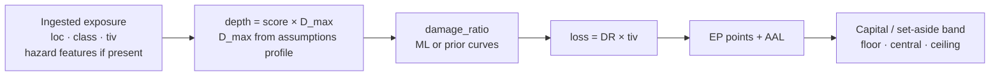

| Concept | Meaning for underwriter |
|---------|-------------------------|
| Floor | Amount below which you are **under-budgeting** severe risk |
| Central | Expected / technical view (e.g. discrete AAL) |
| Ceiling | Amount above which you are likely **over-budgeting** vs appetite |

Exact band formula lives in config/assumptions (not hardcoded per city).

---

## 6. Ingest → any location

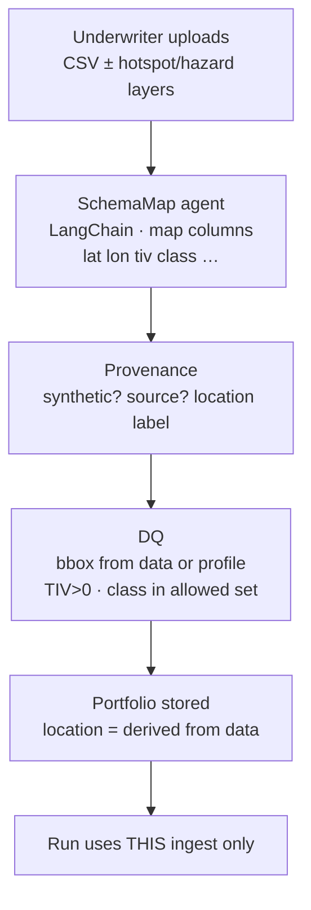

| Flexible input | Bound how? |
|----------------|------------|
| Geography | From uploaded coords / optional bbox in assumptions |
| Housing / occupancy classes | From data + configurable enum / mapper |
| Hazard | Uploaded scores, rasters, or ML features from enrichment |
| RP / D_max / capital policy | Assumptions profile on the run |
| Starter Nairobi kit | One built-in ingest option — not a code special-case forever |

---

## 7. API workflows

### 7a. Ingest → run → insight

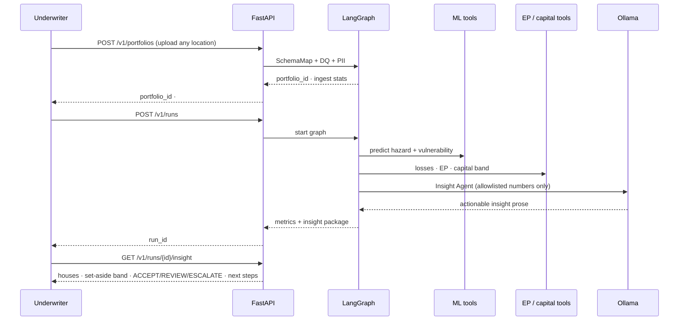

### 7b. Number discipline inside the Insight Agent

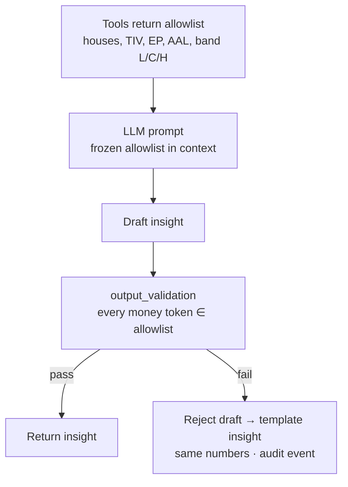

---

## 8. Failure & degrade

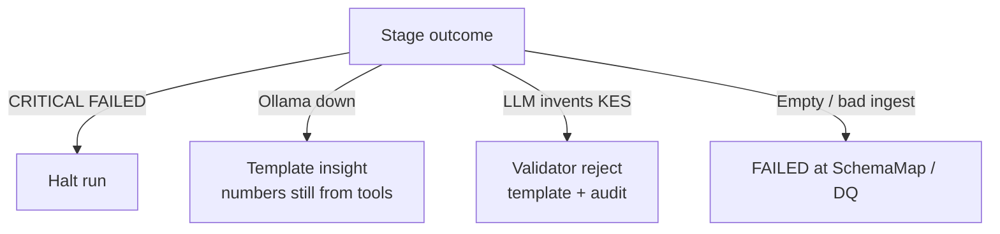

---

## 9. Backend build phases (updated)

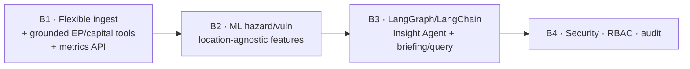

| Phase | Delivers for underwriter |
|-------|--------------------------|
| B1 | Upload book → see #houses, TIV, EP, **set-aside band** |
| B2 | ML changes predictions → losses/band move; delta visible |
| B3 | Natural-language **actionable insight** grounded in tool numbers |
| B4 | Roles, prompt defence, hash-chained decisions |

---

## 10. API surface (insight-centric)

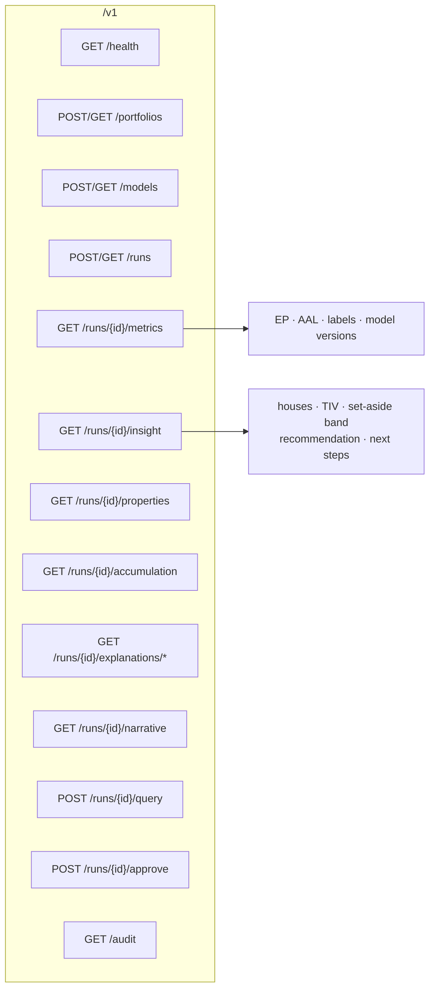

---

## 11. Do we understand the product? (checklist)

| Intent | Captured? |
|--------|-----------|
| Underwriter is the primary user | Yes |
| Works for **different locations** based on **ingested data** | Yes |
| Not Nairobi-hardcoded forever | Yes — starter data only |
| More **ML + LangGraph/LangChain agentic** than brittle rules | Yes |
| LLM **can show money numbers** from **real agentic analysis** | Yes — tools first, then present |
| LLM must **not guess** money | Yes — allowlist validator |
| Simple **actionable** output | Yes — insight package |
| For a place (e.g. Nairobi): **# insured houses** + **amount to set apart** without under/over budgeting | Yes — count + capital band L/C/H |

---

*Nairobi starter kit remains the default demo ingest. Product boundary = whatever valid portfolio the underwriter uploads.*
